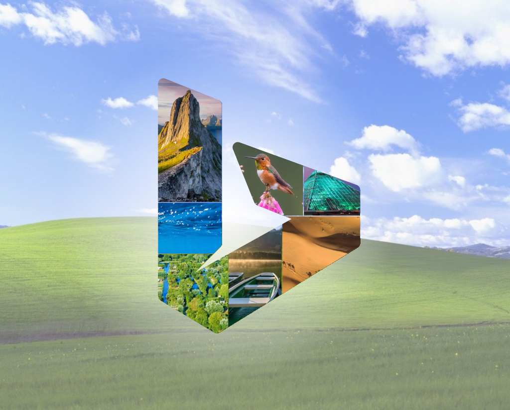

### 4.7.2
# BingWall

#### Actions

#### Code quality

Ce projet est une preuve de concept, il a pour but d'utiliser une fonctionnalité du site [bing.com](https://bing.com/) qui chaque jour partout dans le monde fournis une image quotidiennnement pour chaque régions du monde. L'objectif est de récupérer ces images pour chacune des régions.

En plus de cette simple preuve de concept, ce programme permet d'avoir une banque d'image pour des tests ou des placeholders lors du développement d'application, de plus un petit "exploit" permet de récupérer les images sans le watermark de bing, en effet les images avec une résolution de `1920x1080` n'ont pas le watermark.

Plus d'information dans le wiki du repo!
